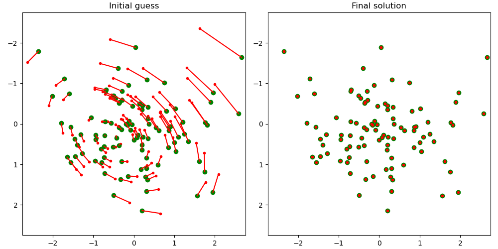

# sl3

Homography Refinement via Optimization on the Lie Group SL(3)

# Motivation

Many applications of computer vision such as camera calibration, tracking, or image registration, rely on the Direct Linear Transformation (DLT) algorithm for estimating homographies. The key weakness of the DLT algorithm is that it minimizes an arbitrary algebraic distance that has no geometric meaning. Consequently, homography estimates obtained using the DLT require further refinement through minimization of geometric error.

To perform refinement, one needs to choose a suitable parameterization of a homography. The most common approach is to operate on the homography matrix directly, fix the last element, and optimize the remaining 8. Another is to explicitly decompose the homography into a product of an upper triangular and an orthogonal matrix (rotation), and use a representation of rotation that lends itself well to optimization, e.g., quaternions or rotation vectors. This project explores a less well-known, elegant, and powerful alternative - the special linear group SL(3) and the associated Lie algebra.

# Implementation

See an excellent paper by Eade (2014) for a comprehensive introduction to Lie groups for computer vision.

The special linear group SL(3) contains unit-determinant 3 x 3 transformation matrices. The Lie algebra sl(3) is an 8-dimensional vector space ("tangent space") around the identity element of SL(3); the vectors in sl(3) are minimal parameterizations of the homography matrices in SL(3). Two key operations, the exponential map and the logarithm, facilitate conversion from algebra to group elements and vice versa, respectively. The exponential map and the logarithm for SL(3) have no closed-from expressions and are implemented with general matrix exponential/logarithm routines by representing the the 8-vectors as linear combinations of the basis elements of sl(3). The basis elements, aka generator matrices, of sl(3) can be found in the paper by Mei (2006).

The 8-DoF parameterization of a homography in sl(3) integrates seamlessly into iterative optimization algorithms. Because addition in sl(3) corresponds to multiplication, i.e., composition of transforms, in SL(3), the solution can be updated via addition in subsequent iterations of optimization, just like any other parameter. And since the group is closed under addition, subsequent estimates are guaranteed to be valid homographies. This integration is easily achieved by calling `exp()` in the cost function to turn the 8-vector into a 3 x 3 homography matrix and evaluating reprojection errors as usual.

To replicate a typical use case, two planar point sets are generated that are related via a homography with small scaling, offset, and rotational components; refinement follows starting from an identity solution (an all-zero vector in sl(3)):

# References

- Eade, E. (2014), *Lie Groups for Computer Vision*, https://ethaneade.com/lie_groups.pdf
- Mei, C., Benhimane, S., Malis, E., and Rives, P. (2006), *Homography-based Tracking for Central Catadioptric Cameras*, https://www.robots.ox.ac.uk/~cmei/articles/omni_track_mei.pdf